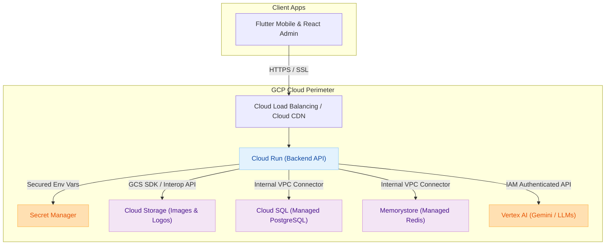

# Google Cloud Platform (GCP) Deployment & Enablement Guide

This guide outlines the exact **GCP Services and APIs** that need to be enabled to deploy, test, and host the **Tubulu Platform** on Google Cloud. It details the recommended managed services, networking setups, and steps to get the environment fully operational.

---

## 🏗️ GCP Architecture Mapping



---

## 🛠️ Required GCP Services & APIs

Below is the list of GCP services that must be enabled in your Google Cloud Project. You can enable them via the GCP Console Search bar or using the `gcloud` command-line utility.

### 1. Compute & Application Hosting
* **Cloud Run API** (`run.googleapis.com`)
  * *Purpose*: The recommended serverless platform to run the Dockerized Node.js backend. It scales automatically, handles high concurrency, and scales down to zero when idle (extremely cost-efficient for testing).
* **Artifact Registry API** (`artifactregistry.googleapis.com`)
  * *Purpose*: Secure, high-performance container registry to store your Docker images (`backend` and `admin_portal`) before deploying to Cloud Run.

### 2. Managed Database & Caching
* **Cloud SQL Admin API** (`sqladmin.googleapis.com`)
  * *Purpose*: Runs your production-ready, fully managed **PostgreSQL** database. Handles automatic backups, security patching, and vertical/horizontal scaling.
* **Google Memorystore for Redis API** (`redis.googleapis.com`)
  * *Purpose*: Provides managed **Redis** instances to support session stores, real-time message brokering, and BullMQ background task processing.

### 3. Object Storage & Media hosting
* **Google Cloud Storage (GCS)** (`storage.googleapis.com`)
  * *Purpose*: Serves as your asset repository to store merchant brand logos, product catalog images, and verified KYC document scans. It is fully S3-compatible, allowing seamless drop-in integrations.

### 4. Advanced AI & Conversational Engine
* **Vertex AI API** (`aiplatform.googleapis.com`)
  * *Purpose*: Connects your **Conversational AI Agent Core** directly to Google's enterprise LLMs (Gemini Pro/Flash) via highly optimized native APIs. Eliminates the need to manage complex GPU infrastructure during testing!

### 5. Networking & Security Core
* **Serverless VPC Access API** (`vpcaccess.googleapis.com`)
  * *Purpose*: Creates a secure VPC connector, allowing your Cloud Run container to establish fast, direct, internal IP connections to Cloud SQL and Memorystore (avoiding public internet traversal).
* **Secret Manager API** (`secretmanager.googleapis.com`)
  * *Purpose*: Securely stores databases keys, JWT secrets, payment tokens (Razorpay), and AI API keys. Prevents hardcoding secrets in env files.

---

## 🚀 Step-by-Step Enablement via terminal

If you have the Google Cloud SDK (`gcloud`) installed, you can enable all required services in a single command block:

```bash
# 1. Authenticate with your Google Account
gcloud auth login

# 2. Set your active target GCP Project ID
gcloud config set project YOUR_GCP_PROJECT_ID

# 3. Enable all required services and APIs
gcloud services enable \
    run.googleapis.com \
    artifactregistry.googleapis.com \
    sqladmin.googleapis.com \
    redis.googleapis.com \
    storage.googleapis.com \
    aiplatform.googleapis.com \
    vpcaccess.googleapis.com \
    secretmanager.googleapis.com
```

---

## 📋 Recommended Environment Checklist for testing

| Component | Current (Local) | Recommended (GCP Production) | Why? |
| :--- | :--- | :--- | :--- |
| **Backend Host** | Local Node Process | **Google Cloud Run** | Zero maintenance, auto-scalable, direct CDN load-balancing. |
| **PostgreSQL** | Local pg Instance | **Cloud SQL (Postgres 15+)** | Fully managed database engine with built-in high availability. |
| **Redis** | Local Redis | **Memorystore for Redis** | In-memory cache for high-throughput messaging. |
| **Media Store** | Public Folder `/images` | **Google Cloud Storage** | Global CDN caching for image asset delivery. |
| **AI LLM** | Local Ollama | **Vertex AI (Gemini Flash)** | Ultra-low latency, pay-per-token API pricing. |

---

## 🔒 Security Best Practices
1. **Never use Public IPs for Databases**: Always restrict Cloud SQL and Memorystore to Private IP configurations and access them strictly via a **Serverless VPC Access Connector**.
2. **Access via Service Account IAM**: Grant your Cloud Run service a dedicated Google Service Account with minimal roles:
   * `roles/secretmanager.secretAccessor` (Reads system secrets)
   * `roles/storage.objectAdmin` (Manages Cloud Storage assets)
   * `roles/aiplatform.user` (Invokes Vertex AI LLM endpoints)
