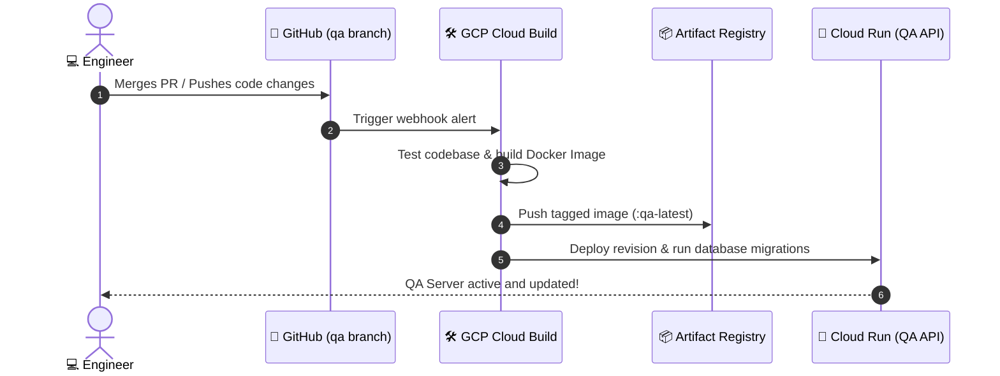

# Tubulu GCP Quality Assurance (QA) Environment Blueprint

This document specifies the architecture, resource requirements, service sizing, and setup guidelines to deploy a fully isolated **Quality Assurance (QA) Environment** on Google Cloud Platform (GCP). 

---

## 🎯 Objectives of the QA Environment
* **Isolation**: Complete separation of database schemas, Redis queues, and storage objects from development and production.
* **Cost Optimization**: Configuring instances to scale to zero when idle, using shared cores, and avoiding multi-zone High Availability (HA) overheads to keep monthly GCP costs extremely low.
* **CI/CD Ready**: Integrated with source control to trigger automated testing and deployments upon pushes to the `qa` or `staging` branches.

---

## 🏗️ Cost-Optimized QA Architecture Map

```mermaid
graph TD
    subgraph Client Apps
        A["📱 Emulator / QA Clients"]
    end

    subgraph QA Virtual Private Cloud (VPC)
        LB["Cloud Load Balancing (SSL)"] --> Run["Cloud Run (QA API) <br/> min:0 / max:3 instances"]
        Run --> |Private IP VPC Connector| SQL["Cloud SQL (PostgreSQL)<br/>db-f1-micro (Shared Core)"]
        Run --> |Private IP VPC Connector| Redis["Memorystore (Redis Basic)<br/>1 GB Capacity"]
        Run --> |IAM Authentication| GCS["Cloud Storage Bucket<br/>tubulu-qa-assets"]
    end

    A --> |Secure HTTPS| LB
    
    classDef run fill:#e3f2fd,stroke:#90caf9,color:#0d47a1;
    classDef store fill:#f3e5f5,stroke:#ce93d8,color:#4a148c;
    class Run run;
    class SQL,Redis,GCS store;
```

---

## 📋 Services, Requirements & Sizing Specifications

Below are the exact GCP services to enable, accompanied by the cost-optimized **QA-specific sizing parameters**:

### 1. API Hosting: Google Cloud Run
* **Requirement**: Runs the Dockerized Node.js backend application.
* **QA-Specific Sizing**:
  * **Min Instances**: `0` (Forces the service to scale down to zero when QA testers are offline, saving 100% of compute costs at night and weekends).
  * **Max Instances**: `3` (Prevents runaway costs during stress testing).
  * **vCPU**: `1 vCPU`
  * **Memory**: `1 GB RAM`
  * **Concurrency**: `80` requests per instance.

### 2. Relational Storage: Cloud SQL for PostgreSQL
* **Requirement**: Hosts the transactional schemas, merchant catalogues, and active orders.
* **QA-Specific Sizing**:
  * **Machine Type**: `db-f1-micro` (Shared core, 1 vCPU, 0.6 GB RAM) or `db-g1-small` (1.7 GB RAM) $\rightarrow$ *Extremely economical, starting at ~$10/month.*
  * **Storage**: `10 GB SSD` (with automatic storage increase enabled).
  * **Availability**: `Single Zone` (Disable high availability failovers for QA to cut costs by 50%).
  * **Backups**: Enabled, retaining logs for `7 days`.

### 3. Caching & Queue Broker: Cloud Memorystore for Redis
* **Requirement**: In-memory storage for active cart tracking and campaign queues (BullMQ).
* **QA-Specific Sizing**:
  * **Tier**: `Basic Tier` (Single node instance, no replication/failover nodes needed for QA).
  * **Capacity**: `1 GB` (More than sufficient for sandbox/functional verification tests).

### 4. Object Repository: Google Cloud Storage (GCS)
* **Requirement**: Securely stores sandbox merchant logos, catalog assets, and document uploads.
* **QA-Specific Sizing**:
  * **Location**: `Regional` (e.g. `us-central1` or local regional region to avoid multi-regional storage charges).
  * **Class**: `Standard Storage`.
  * **CORS Policy**: Configured to trust QA web portal domains (`http://localhost:5173` or public web links).

### 5. AI Completions: Vertex AI (Gemini Pro/Flash API)
* **Requirement**: Supplies LLM completions directly to chatbot testing.
* **QA-Specific Sizing**:
  * **Model Choice**: `Gemini 1.5 Flash` (Provides lightning-fast conversational response times at 1/10th the cost of Gemini Pro, ideal for automated QA chat runs).

---

## 🔒 Required Secret Manager Keys for QA

The QA environment must store its environment parameters securely inside **GCP Secret Manager**. The keys to define include:

```env
QA_DB_HOST=10.x.x.x (VPC Private IP of Cloud SQL)
QA_DB_NAME=tubulu_qa
QA_DB_USER=postgres_qa
QA_DB_PASS=*******
QA_REDIS_HOST=10.x.x.y (VPC Private IP of Redis)
QA_JWT_SECRET=tubulu_qa_jwt_signature_key_2026
QA_RAZORPAY_KEY_ID=rzp_test_xxxxxx (Sandbox Merchant ID)
QA_RAZORPAY_KEY_SECRET=xxxxxx (Sandbox Key)
```

---

## 🚀 Setup Steps & Enablement Script

Follow these steps using the Google Cloud SDK terminal to initialize your isolated QA environment:

```bash
# 1. Create a dedicated QA GCP Project to ensure 100% boundary isolation
gcloud projects create tubulu-qa-env --name="Tubulu QA Environment"

# 2. Link your active billing account to the QA Project
# (Replace with your billing account ID)
gcloud beta billing projects link tubulu-qa-env --billing-account=012345-6789AB-CDEF01

# 3. Target the newly created QA Project
gcloud config set project tubulu-qa-env

# 4. Enable the 8 essential APIs for the QA ecosystem
gcloud services enable \
    run.googleapis.com \
    artifactregistry.googleapis.com \
    sqladmin.googleapis.com \
    redis.googleapis.com \
    storage.googleapis.com \
    aiplatform.googleapis.com \
    vpcaccess.googleapis.com \
    secretmanager.googleapis.com

# 5. Create an Artifact Registry to host the QA Docker images
gcloud artifacts repositories create qa-docker-repo \
    --repository-format=docker \
    --location=us-central1 \
    --description="Docker Registry for QA Containers"

# 6. Set up the cost-optimized single-zone Cloud SQL Database
gcloud beta sql instances create tubulu-qa-db \
    --database-version=POSTGRES_15 \
    --tier=db-f1-micro \
    --region=us-central1 \
    --storage-type=SSD \
    --storage-size=10GB
```

---

## 🔄 Automated CI/CD Lifecycle for QA

A modern QA environment should redeploy automatically. Below is the workflow triggered when developers merge a Pull Request into the `qa` branch:


