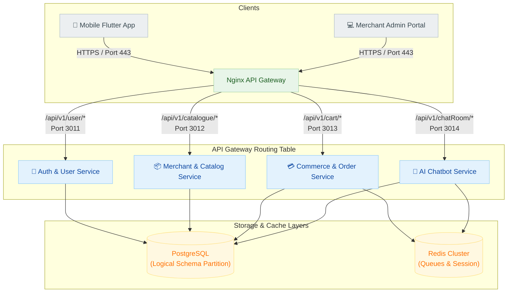
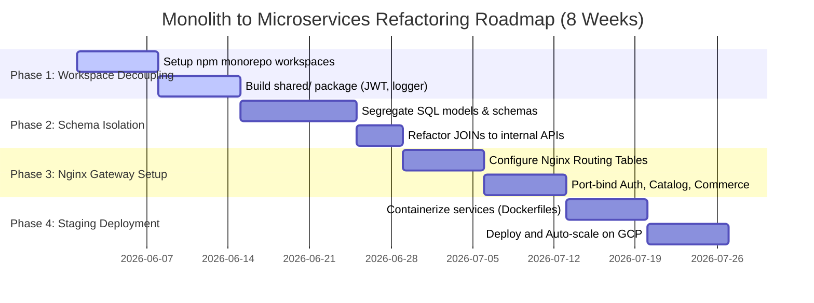

# Tubulu Monolith-to-Microservices Migration Plan

This document outlines the strategic architectural blueprint, module divisions, network routing maps, and a 4-Phase execution schedule to successfully refactor the monolithic Tubulu backend (223 endpoints) into a modern **Modular Microservices Architecture** on Google Cloud Platform.

---

## 🏗️ Target Architectural Design

Rather than maintaining a single monolithic server process, the platform is divided into **4 isolated core services** coordinated via an **API Gateway**:



---

## 🗂️ Service Module Divisions

---

### 1️⃣ Authentication & User Service (`auth-service`) — `Port 3011`
*Focuses strictly on customer identity management, security credentials, and device linkages.*

* **Encompassed Routes**:
  * `/api/v1/user/*` (Customer logins, OTP checks, PIN verification)
  * `/api/v1/userDevice/*` (Push notification mapping keys)
  * `/api/v1/address/*` (Delivery shipping addresses)
* **Active Tables**: `Users`, `UserDevices`, `UserAddresses`
* **Infrastructure**: Zero external calls; serves as the central identity verifier issuing standard JWT signatures.

---

### 2️⃣ Merchant & Catalog Service (`catalog-service`) — `Port 3012`
*Maintains physical storefront registries, KYC validation documents, product directories, and vertical specifications.*

* **Encompassed Routes**:
  * `/api/v1/integrations/*` (Store profiles, KYC file uploads, branch networks)
  * `/api/v1/catalogue/*` (Folder divisions, menu groups)
  * `/api/v1/products/*` (SKU parameters, variant configurations, Swiggy import scrapers)
  * `/api/v1/customization/*` (Admin portal UI elements styles)
  * `/api/v1/qrcode/*` (Dynamic store check-in QR codes)
* **Active Tables**: `Integrations`, `Catalogues`, `Products`, `Customizations`, `QRCodes`, `BlockedIntegrations`
* **Cross-Service Hook**: Communicates with the `auth-service` via internal HTTP calls to verify merchant-admin profile updates.

---

### 3️⃣ Commerce & Transaction Service (`commerce-service`) — `Port 3013`
*Powers checkout checkouts, coupon distributions, marketing banner slider slots, and payment gateways.*

* **Encompassed Routes**:
  * `/api/v1/cart/*` (Checkout shopping list calculations)
  * `/api/v1/orders/*` (Checkout bookings, Razorpay webhook processor)
  * `/api/v1/deal/*` (Coupon validations, dynamic promo rules)
  * `/api/v1/advertisement/*` (Ad banner scheduling indices)
  * `/api/v1/settlements/*` (Payout files audits)
  * `/api/v1/payment-connection/*` (Gateway API keys setups)
* **Active Tables**: `Carts`, `Orders`, `Deals`, `Advertisements`, `Settlements`, `UserDealUsages`
* **Infrastructure**: Standard webhook listeners listening to Razorpay servers, writing transaction results directly to database schemas.

---

### 4️⃣ AI Chatbot & Messaging Service (`chat-ai-service`) — `Port 3014`
*Coordinates Gemini LLM plays, BullMQ broadcast queues, real-time WebSockets, and SMS networks.*

* **Encompassed Routes**:
  * `/api/v1/chatRoom/*` (WebSocket channels directories)
  * `/api/v1/chatMessage/*` (Messaging exchange, S3 uploads routing)
  * `/api/v1/ai-playbooks/*` (LLM instructions guidelines registers)
  * `/api/v1/ai/*` (Gemini API completions calls)
  * `/api/v1/whatsapp/*` (Meta API channels integrations)
  * `/api/v1/campaign/*` (BullMQ mass broadcast scheduler)
* **Active Tables**: `ChatRooms`, `ChatMessages`, `AICategoryPlaybooks`, `VendorAIConfigs`, `Campaigns`, `CampaignTemplates`, `MessageBookmarks`, `MessageNotes`
* **Infrastructure**: Requires high computational/networking bandwidth; heavily bound to standard **Redis memory queues** and **Vertex AI APIs**.

---

## 🛠️ The Implementation & Migration Roadmap

To transition smoothly without disrupting your current QA timelines, we execute a **4-Phase Roadmap**:



### 📅 Phase 1: Repository Workspace Decoupling (Weeks 1-2)
* Restructure the codebase into a **Monorepo** using **npm workspaces**.
* Create a dedicated `shared/` directory to house common utilities:
  * [Postgres.js Connection Utils](file:///Users/pradeep/Desktop/Tubulu-v1/backend/Utils/Postgres.js)
  * [VerifyToken.Middleware](file:///Users/pradeep/Desktop/Tubulu-v1/backend/MiddleWare/VerifyToken.Middleware.js)
  * Logging structures, configurations, and baseline validators.

### 📅 Phase 2: Database Schema & Query Isolation (Weeks 3-4)
* Enforce **logical database schema partition** (e.g. Auth tables under schema `auth`, products tables under schema `inventory`).
* **Crucial Step**: Refactor SQL `JOIN` statements that cross service boundaries. Instead of joining `Products` with `Integrations` via a direct SQL query, the `inventory-service` queries the `catalog-service` over a lightweight internal HTTP `/internal/integrations/:id` API call.

### 📅 Phase 3: Nginx API Gateway Setup (Weeks 5-6)
* Place Nginx in front of all services. Nginx listens on Port `80`/`443` and handles SSL termination.
* Configure Nginx routing rules:
  ```nginx
  location /api/v1/user/ { proxy_pass http://127.0.0.1:3011; }
  location /api/v1/integrations/ { proxy_pass http://127.0.0.1:3012; }
  location /api/v1/catalogue/ { proxy_pass http://127.0.0.1:3012; }
  location /api/v1/products/ { proxy_pass http://127.0.0.1:3012; }
  location /api/v1/cart/ { proxy_pass http://127.0.0.1:3013; }
  location /api/v1/orders/ { proxy_pass http://127.0.0.1:3013; }
  location /api/v1/chatRoom/ { proxy_pass http://127.0.0.1:3014; }
  location /api/v1/ai/ { proxy_pass http://127.0.0.1:3014; }
  ```

### 📅 Phase 4: Dynamic Autoscaling on GCP Staging (Weeks 7-8)
* Containerize all four services separately using lightweight Alpine Dockerfiles.
* **The Magic of GCP**: You can easily keep standard database CRUD services (`auth`, `catalog`, `commerce`) running inside your cost-efficient **Compute Engine QA VM**, while deploying the high-intensity `chat-ai-service` to **Google Cloud Run (Serverless)**!
* This gives you instant autoscaling for LLM chat operations without paying for idling servers during testing off-hours!
