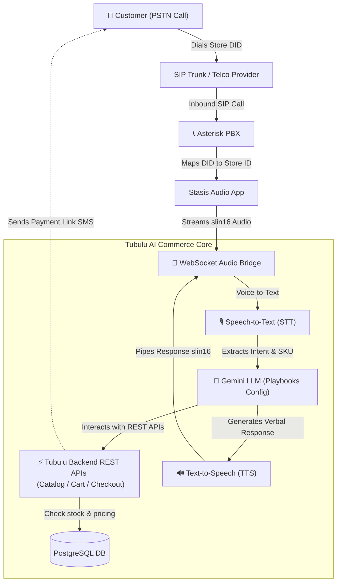

# Tubulu PSTN Voice-AI Commerce Gateway: Architectural Alignment

This document outlines the strategic conceptual mapping, core platform comparisons, API bindings, and the transaction execution lifecycle to support **Voice-AI Commerce** on the Tubulu Platform.

---

## 🎯 Executive Summary & Concept Mapping

The objective is to enable friction-free, voice-driven retail. Customers dial a physical store's dedicated phone number (DID), and a conversational AI agent immediately answers, queries the store's inventory, manages a shopping cart, and completes checkout—all over a standard PSTN voice call.

---

## ⚖️ Architectural Comparison: Vedanth vs. Tubulu Voice-Commerce

The underlying low-latency streaming infrastructure is **virtually identical** to your stable **Vedanth AI** appointment booking system, but the core business actions map to different database modules:

| Feature / Core Engine | 🏥 Vedanth AI Appointment System | 🛒 Tubulu Voice-AI Commerce Gateway |
| :--- | :--- | :--- |
| **Audio Pipe** | Bidirectional AudioSocket/WS bridge (slin16). | Bidirectional AudioSocket/WS bridge (slin16). |
| **Intent Processing** | Multilingual (English/Hindi/Kannada) slot-filling. | Multilingual product discovery and quantity matching. |
| **Entity Extracted** | Target Date, Time, Doctor ID, Patient Name. | Product SKU, Brand Name, Variant/Weight, Quantity. |
| **Inventory Source** | Appointment Calendar slots database. | **[Products](file:///Users/pradeep/Desktop/Tubulu-v1/backend/Models/Product.pg.js) & [Catalogues](file:///Users/pradeep/Desktop/Tubulu-v1/backend/Models/Catalogue.pg.js) tables.** |
| **Transaction Action** | Create Doctor Appointment schedule record. | **Register Cart items, checkout, and send billing SMS.** |

---

## ⚡ Powering Voice-Commerce with Tubulu's 223 REST APIs

The AI agent does not query the database directly. Instead, it behaves exactly like a headless frontend application, invoking your existing **REST API endpoints** sequentially during the call:

### 1. Store Discovery & Configuration (DID Mapping)
* When a call lands on Asterisk, the incoming DID (dialed number) is mapped to the merchant's **Integration ID**.
* The AI calls **`GET /api/v1/integrations/byId/:id`** to load:
  * Store details (Name, Address, Delivery ranges).
  * The active **[AI Category Playbook](file:///Users/pradeep/Desktop/Tubulu-v1/backend/Models/AICategoryPlaybook.pg.js)** prompt guidelines to enforce tone of voice and grocery rules.

### 2. Product Discovery & SKU Matching
* When the caller says: *"Do you have organic milk and gluten-free sourdough bread?"*
* The AI invokes: **`GET /api/v1/products/search/:catalogueId?query=milk`**
* It reads the custom `specifications` payload to reply: *"Yes, we have Amul Organic Whole Milk (1 Liter) for ₹85 and Artisan Sourdough Bread (400g) for ₹120. Which would you like to add?"*

### 3. Shopping Cart Management
* When the caller says: *"Add 2 bottles of organic milk and one loaf of bread."*
* The AI dynamically routes standard payloads to:
  * **`POST /api/v1/cart/add`**
* It then queries **`GET /api/v1/cart`** to fetch totals: *"Added. Your subtotal is ₹290, plus ₹30 delivery. Shall I place the order?"*

### 4. Checkout & Secure SMS Billing
* When the customer confirms: *"Yes, place the order."*
* The AI invokes **`POST /api/v1/orders/checkout`** with the customer's phone number as the destination.
* The backend generates a pending Order ID and triggers the **Razorpay gateway link generation**.
* The system sends a SMS text containing the checkout payment link to the caller's mobile: *"I have booked your items! A payment link has been sent to your phone. Once paid, the store will prepare your delivery."*

---

## 🚀 Key Implementation Milestones

To implement this rapidly on your **GCP Compute Engine QA Environment**:

1. **Provision DID VoIP SIP Trunks**: Hook up regional VoIP providers (like Tata Tele, Jio, or Exotel) and route incoming traffic directly to your Asterisk instance.
2. **Reuse the Audio Bridge**: Run your reviewed `WEBRTC_OBD_PRADEEP` Express server.
3. **Map the Phone-to-Store Metadata**: Add a new column `pstnDID` in the `Integrations` Postgres schema to dynamically map dialed numbers to specific store profiles.
4. **Deploy Multilingual AI**: Configure the Gemini LLM engine with standard prompt constraints to parse item matching, and handle language switches dynamically!
