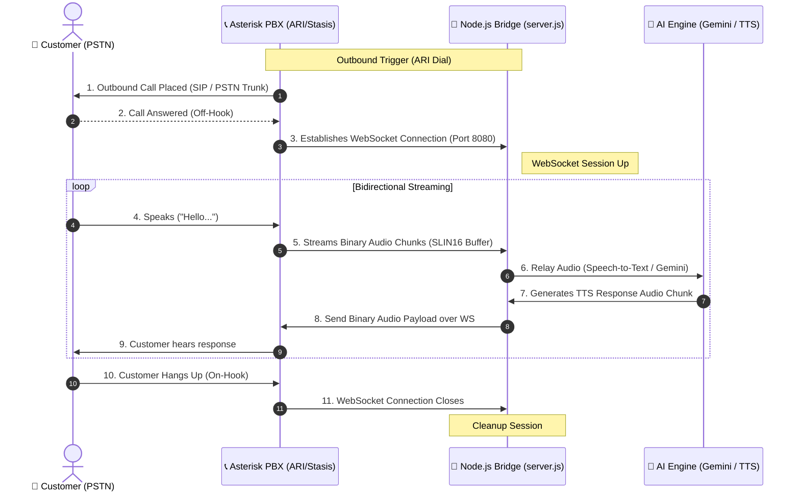

# PSTN WebRTC OBD (Outbound Dialer) Code Review & Assessment

This document provides a highly detailed, professional code review and architectural analysis of the **`WEBRTC_OBD_PRADEEP`** WebSocket Audio Bridging Gateway designed for Asterisk PSTN Outbound Dialer (OBD) integrations.

---

## 🏗️ Architectural Understanding & Call Flow

The `WEBRTC_OBD_PRADEEP` node server acts as the **bidirectional audio gateway** connecting standard telephone networks (PSTN) to modern AI conversational systems. It bridges the physical audio channels of an **Asterisk PBX** to digital processing streams over WebSockets (WS/WSS).



---

## 🔍 Codebase Assessment

The pasted codebase is lightweight, highly modular, and provides an excellent foundation for low-latency streaming:

### 1️⃣ Configuration Audit ([.env](file:///Users/pradeep/Desktop/Tubulu-v1/WEBRTC_OBD_PRADEEP/.env))
* **Port Bindings**: Defaults to Port `8080`.
* **SSL/TLS Control (`USE_WSS=false`)**: Configurable to enable secure WebSockets (WSS). Secure connections are highly recommended for staging and production because standard browsers and mobile applications block unencrypted `ws://` traffic over public domains.
* **Asterisk REST Interface (ARI)**: Points to `http://localhost:8088` with Stasis app handler `audio-stream-app` mapped out. This allows the dialer logic to control channels programmatically.

### 2️⃣ Logic Audit ([server.js](file:///Users/pradeep/Desktop/Tubulu-v1/WEBRTC_OBD_PRADEEP/server.js))
* **Protocol Switching (Lines 20-40)**: Safely detects `USE_WSS` and constructs either an HTTPS or HTTP listener.
* **WebSocket Attachment (Line 43)**: Binds the `ws` server directly to the active express server, ensuring unified port bindings.
* **Payload Multiplexing (Lines 49-71)**:
  * **Binary Branch (Line 53)**: Correctly identifies raw PCM binary audio blocks via `Buffer.isBuffer(message)`. These represent standard `slin16` (Signed Linear 16-bit, 16kHz mono) chunks streamed by Asterisk Audiosocket at ~20ms intervals.
  * **Text/JSON Branch (Line 60)**: Safely parses string messages (JSON events) and captures vital session metadata, preventing the server from crashing if Asterisk sends non-binary events.

---

## 🚀 Key Recommendations for Staging & Production

To take this baseline bridge server and deploy it as a fully operational, two-way AI call dialer, we recommend integrating the following code enhancements:

### A. Implementing Real-Time Speech-to-Text (STT)
Piping the binary buffers to **Google Cloud Speech-to-Text (Streaming Recognition)** in real time:

```javascript
const speech = require('@google-cloud/speech');
const client = new speech.SpeechClient();

const request = {
  config: {
    encoding: 'LINEAR16',
    sampleRateHertz: 16000,
    languageCode: 'en-US',
  },
  interimResults: true,
};

// Spawn a streaming recognize pipe per connection
const recognizeStream = client
  .streamingRecognize(request)
  .on('data', data => {
      const transcript = data.results[0].alternatives[0].transcript;
      console.log(`[Transcript]: ${transcript}`);
      // Trigger AI conversational completion hook here!
  });

// Inside your Buffer.isBuffer handler:
ws.on('message', (message) => {
    if (Buffer.isBuffer(message)) {
        recognizeStream.write(message); // Write raw slin16 buffer directly
    }
});
```

### B. Sending Audio Responses Back to the Customer
To speak back to the customer, package the audio into **raw linear PCM 16-bit chunks** and send it directly back through the open WebSocket channel:

```javascript
// To speak back, send binary buffer back to Asterisk
function speakToCustomer(ws, pcmAudioBuffer) {
    if (ws.readyState === WebSocket.OPEN) {
        ws.send(pcmAudioBuffer, { binary: true });
    }
}
```

### C. Concurrency & Scaling Considerations
* **Buffer Backpressure**: Raw 16kHz audio outputs ~32 KB of data per second. Ensure the Node thread is not blocked by heavy calculations to prevent packet loss.
* **Clustering**: Keep this dialer running on your **GCP Compute Engine VM** inside an isolated Docker container, using PM2 or Docker-Compose to autoscale to multiple CPU cores!
