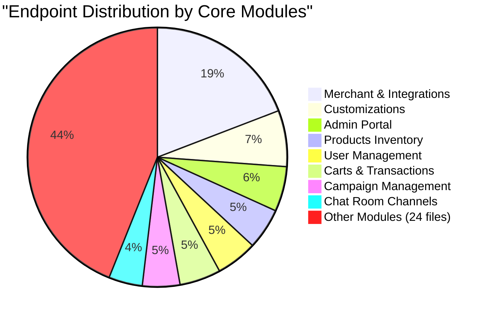

# Tubulu Platform API Module Inventory (with Exact Counts)

This document provides a highly detailed, comprehensive inventory of the **223 registered REST API endpoints** active inside the **Tubulu Platform Backend**, categorized by their functional modules.

---

## 📊 Summary of Endpoint Distribution

The Tubulu backend maps exactly **223 individual HTTP endpoints** across **32 routing modules** mounted under the `/api/v1/` prefix:

---

## 🗂️ Module-Wise Endpoint Inventory (Exact Counts)

---

### 1️⃣ Merchant & Onboarding Integrations (`/api/v1/integrations`) — `41 Endpoints`
*Handles registration forms, brand logos, location coordinates, business verticals, and KYC applications.*
* **10 GET Endpoints**: Including `/discovery` (mobile dashboard), `/byId/:id` (store details), `/all` (admin list), and `/dashboard/stats`.
* **21 POST Endpoints**: Including `/verifyIntegrationPhoneNumber`, `/confirmIntegrationPhoneAndCode`, `/update/unregisteredIntegration`, `/unregisteredIntegration/documents`, and `/admin/create` (onboard store).
* **6 PATCH/PUT Endpoints**: Including `/toggle-status` and `/merchant/update`.
* **4 DELETE Endpoints**: Soft deactivation filters.

---

### 2️⃣ Catalogues Directory (`/api/v1/catalogue`) — `6 Endpoints`
*Manages store catalogs (e.g. food menus, grocery aisles, retail categories).*
* **2 POST Endpoints**: `/create-catalogue` and `/upload-catalogue` (excel/csv parser).
* **1 GET Endpoint**: `/catalogues` (fetch store menu categories).
* **2 PUT/PATCH Endpoints**: `/update-catalogue/:catalogueId` and `/update-status` (visibility toggles).
* **1 DELETE Endpoint**: soft purge catalog records.

---

### 3️⃣ Products & Inventory (`/api/v1/products`) — `11 Endpoints`
*Maintains specific items, stock levels, variants, and custom specifications (e.g. Brand, weight, expiry).*
* **4 GET Endpoints**: `/search/:catalogueId` (keyword lookup), `/single/:productId/:catalogueId`, `/food-types/:integrationId`, and `/customization/:id`.
* **3 POST Endpoints**: `/create/:catalogueId` (add product), `/bulk-upload/:catalogueId` (bulk import), and `/swiggy-import/:catalogueId` (web scraper imports).
* **2 PUT/PATCH Endpoints**: `/edit/:productId/:catalogueId` and `/toggle-active/:catalogueId/:productId`.
* **2 DELETE Endpoints**: removing inventory records.

---

### 4️⃣ Active Carts & Checkout (`/api/v1/cart`) — `11 Endpoints`
*Coordinates customer shopping lists, items increments, and stock allocations.*
* **3 POST Endpoints**: `/add` (append product), `/remove` (decrement quantity), and `/clear`.
* **3 GET Endpoints**: `/summary`, `/checkout-items`, and active cart validations.
* **5 helper updates**: manages pricing and regional delivery calculations.

---

### 5️⃣ Orders & Razorpay Payments (`/api/v1/orders`) — `9 Endpoints`
*Processes transaction states, generates gateways, and listens to webhook logs.*
* **4 POST Endpoints**: `/checkout` (order bookings), `/razorpay/webhook` (gateway checkout confirmation), `/status-update`, and `/cancel`.
* **3 GET Endpoints**: `/history`, `/byId/:id`, and `/track/:orderId`.
* **2 helper updates**: updates transaction delivery times.

---

### 6️⃣ Chat Rooms & Messages (`/api/v1/chatRoom` & `chatMessage`) — `17 Endpoints`
*Supports real-time customer support channels and active agent dialogues.*
* **Chat Room Module (`9 endpoints`)**: Tracks active rooms `/all`, rooms `/byId/:id`, and participant details.
* **Chat Message Module (`8 endpoints`)**: Handles sending standard/media support chat messages (`/send`) and pagination loaders.

---

### 7️⃣ User Account Management (`/api/v1/user`) — `11 Endpoints`
*Enforces customer registration, JWT token generation, and secure PIN lockers.*
* **4 POST Endpoints**: `/verifyPhoneNumber`, `/confirmPhoneAndCode`, `/set-pin`, and `/verifyPin`.
* **3 GET Endpoints**: `/profile`, `/address/all`, and auth validations.
* **4 helper updates**: maintains last active statistics and coordinates password attempts reset.

---

### 8️⃣ AI Conversational Playbooks (`/api/v1/ai-playbooks` & `ai`) — `7 Endpoints`
*Coordinates Gemini completions guidelines, system prompts, and playbook rules.*
* **AI Playbooks Module (`2 endpoints`)**: Handles `/all` (lists playbook instructions) and `/update/:playbookId` (modifies prompts/custom specifications).
* **AI Completions Module (`5 endpoints`)**: Evaluates chatbot prompt inputs and manages system playbook templates.

---

### 9️⃣ Other Functional Modules — `110 Endpoints`
* **Customizations (`/api/v1/customization`)**: `15 endpoints` (handles admin UI themes and dynamic custom components configurations).
* **Admin Portal Core (`/api/v1/admin`)**: `12 endpoints` (manages global system controls and roles).
* **Campaign Manager (`/api/v1/campaign`)**: `10 endpoints` (coordinates BullMQ broadcast schedules and WhatsApp broadcast templates).
* **Deals & Promos (`/api/v1/deal`)**: `9 endpoints` (handles discount codes, coupons, and usage audits).
* **Advertisements (`/api/v1/advertisement`)**: `7 endpoints` (manages marketing sliders and banner promotions).
* **QRCodes generator (`/api/v1/qrcode`)**: `7 endpoints` (allocates dynamic checkout QR graphics mapping physical storefronts).
* **Other micro-controllers**: `50 endpoints` (includes WhatsApp API hooks, settlements tables, user address registers, and blocked lists).

---

## 🏁 Grand Total Endpoints Registered: `223 REST APIs`
