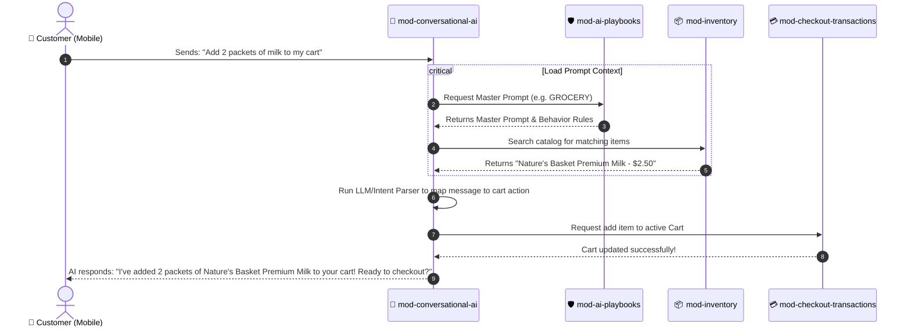

# Tubulu Modular System Architecture & Module Map

This document outlines the architectural blueprint for modularizing the **Tubulu Platform**. Defining the entire application into logical and physical modules allows the engineering team to transition from a single codebase structure into a **clean modular monolith** or **monorepo microservices**, paving the way for easier feature isolation, high-performance scaling, and independent deployability.

---

## 🗺️ Architectural Block Diagram

```mermaid
graph TD
    subgraph Client Suite (Apps)
        A["Mobile App (Flutter)"] <--> |REST / WebSockets| AP["API Gateway (Express)"]
        B["Admin Portal (React Vite)"] <--> |REST / WebSockets| AP
    end

    subgraph Modular Backend Monolith
        AP --> M1["1. Identity, Auth & Core Infrastructure"]
        AP --> M2["2. Merchant Onboarding & KYC Pipeline"]
        AP --> M3["3. AI Playbooks & Persona Engine"]
        AP --> M4["4. Catalog & Custom Inventory"]
        AP --> M5["5. Conversational AI Agent Core"]
        AP --> M6["6. Checkout, Transactional & Booking Engine"]
    end

    subgraph Storage & Cache Layers
        M1 & M2 & M4 & M6 --> DB[(PostgreSQL Database)]
        M1 & M5 & M6 --> Cache[(Redis Cache & BullMQ Queue)]
    end
    
    classDef client fill:#3366FF,stroke:#254EDB,color:#fff;
    classDef module fill:#e3f2fd,stroke:#90caf9,color:#0d47a1;
    classDef store fill:#f3e5f5,stroke:#ce93d8,color:#4a148c;
    class A,B client;
    class M1,M2,M3,M4,M5,M6 module;
    class DB,Cache store;
```

---

## 📦 Deep-Dive: Logical Application Modules

Below is the detailed breakdown of the Tubulu suite organized into **6 core functional modules**. Each section details the **Backend Routes & Logic**, the **Frontend UI Elements**, and the **Database Models** that define its operation.

### 1. Identity, Auth & Infrastructure Module (`mod-auth-core`)
**Objective**: Handles user authentication, device token registrations, secure session storage, background job orchestration, and utility support (logging, helper structures).

* **Backend Files & Routes Map**:
  * `/api/v1/user` $\rightarrow$ `User.Routes.js` (OTP generation, verification, logins)
  * `/api/v1/userDevice` $\rightarrow$ `UserDevice.Routes.js` (Registers mobile device tokens for notifications)
  * `/admin` $\rightarrow$ BullBoard background job queue dashboard (BullMQ)
* **Frontend UI Map**:
  * `apps/admin_portal/src/auth/` (JWT provider contexts, login screens, passcode confirmations)
  * `apps/tubulu_mobile/lib/` (OTP login pages, token persistence, user profile caching)
* **Database Models**:
  * `User` (Credentials, role, state)
  * `UserDevice` (FCM tokens, OS type, last online date)

---

### 2. Merchant Onboarding & KYC Pipeline (`mod-merchant-kyc`)
**Objective**: Manages the merchant sign-up flow, profile creation, business parameter tracking, and runs the automated document audit process (GST, PAN, Aadhaar checking) that calculates the merchant's **Trust Score**.

* **Backend Files & Routes Map**:
  * `/api/v1/integrations` $\rightarrow$ `Integration.Route.js` (Merchant details, branch hierarchies, public location coordinates)
  * `/api/v1/admin/integration/:id/kyc` $\rightarrow$ `Admin.routes.js` (Triggers KYC verification pipeline)
* **Frontend UI Map**:
  * `apps/admin_portal/src/sections/merchants/` (Merchant list grids, edit drawers, and manual approval dialogs)
  * `apps/admin_portal/src/pages/dashboard/user-profile.tsx` (Merchant details and business document upload forms)
* **Database Models**:
  * `Integration` (Merchant profile details, location tags, parent brand association, active status)
  * `IntegrationDocuments` (GSTIN, PAN, Aadhaar base64 attachments, and verification status)

---

### 3. AI Playbooks & Persona Engine (`mod-ai-playbooks`)
**Objective**: Standardizes the AI Agent personalities across various business verticals. Allows the Platform Manager to set default categories (e.g., F&B, Grocery) and associate custom master prompts and required product attributes.

* **Backend Files & Routes Map**:
  * `/api/v1/ai-playbooks` $\rightarrow$ `AIPlaybook.routes.js` (Fetch and configure playbooks, templates, and category master keys)
* **Frontend UI Map**:
  * `apps/admin_portal/src/sections/ai-playbooks/` (Vertical layout designer, persona configuration cards, and custom prompt editors)
* **Database Models**:
  * `AIPlaybook` (Category key, vertical display name, master prompt text, dynamic attributes checklist)

---

### 4. Catalog & Custom Inventory Module (`mod-inventory`)
**Objective**: Houses the merchant catalog, sub-category routing, custom variant combinations, dynamic tags, and general search discovery systems.

* **Backend Files & Routes Map**:
  * `/api/v1/catalogue` $\rightarrow$ `Catalogue.Routes.js` (Handles store-specific catalogues and menus)
  * `/api/v1/products` $\rightarrow$ `Product.Routes.js` (Dynamic items, images, dynamic attributes parsing)
* **Frontend UI Map**:
  * `apps/admin_portal/src/sections/products/` (Add/edit inventory dialogs, SKU builders)
  * `apps/tubulu_mobile/lib/` (Catalog explorer lists, variant selector dialogs)
* **Database Models**:
  * `Catalogue` (Catalog title, active/inactive switch)
  * `Product` (Item name, description, price, measurements, stock levels, raw database logo URL, custom attributes list)

---

### 5. Conversational AI Agent Core (`mod-conversational-ai`)
**Objective**: Orchestrates direct AI-driven interactions. Merges dynamic context (catalogue, store details, active cart) with the Master Playbook prompt, executes LLM completions, and parses natural-language conversational intents into actionable triggers.

* **Backend Files & Routes Map**:
  * `/api/v1/chatbot` $\rightarrow$ `Chatbot.Route.js` (Core processing pipeline for direct chat communication)
  * `/api/v1/chatRoom` $\rightarrow$ `ChatRoom.Route.js` (Rooms grouping customers and store managers)
  * `/api/v1/chatMessage` $\rightarrow$ `ChatMessage.Route.js` (Message stream logs, attachment files, and message annotations)
* **Frontend UI Map**:
  * `apps/tubulu_mobile/lib/screens/chat/` (High-fidelity chat interface displaying dynamic card overlays)
* **Database Models**:
  * `ChatRoom` (Customer and merchant associations, last active timestamp)
  * `ChatMessage` (Sender role, body content, parsed actions payload, read/unread states)

---

### 6. Checkout, Transactional & Booking Engine (`mod-checkout-transactions`)
**Objective**: Powers transactional flows generated by the customer or triggered from conversational chat intents, including Cart updates, order tracking, online payment processing, and appointment bookings.

* **Backend Files & Routes Map**:
  * `/api/v1/cart` $\rightarrow$ `Cart.Routes.js` (Manage customer cart additions and active cart validation)
  * `/api/v1/orders` $\rightarrow$ `Order.Routes.js` (Checkout endpoints, status state-machine transitions, Razorpay payment capture webhook integration)
  * `/api/v1/address` $\rightarrow$ `UserAddress.Routes.js` (Stores delivery locations for final checkouts)
* **Frontend UI Map**:
  * `apps/tubulu_mobile/lib/screens/cart/` & `screens/orders/` (Cart checklists, order history cards)
  * `apps/admin_portal/src/sections/orders/` (Merchant-side active order boards and dispatch controls)
* **Database Models**:
  * `Cart` & `CartItem` (Active cart selection details)
  * `Order` & `OrderItem` (Payment status, transaction logs, table selection, or dispatch states)

---

## 📈 Key Data Flow: Conversational Intent Checkout

This flow shows how the modular structure isolates the complex process of going from a Chat Message to an Order:



---

## 🚀 Future Roadmap: How to physically partition the code

If your engineering team wants to transition from the current folder structure to a fully isolated **Modular Monorepo**, here is the recommended evolutionary path:

### Step 1: Create a Shared Packages Directory
Move shared resources into standalone local npm packages inside `/packages` (e.g., `packages/database` for Sequelize configuration and connection pools, `packages/utils` for general functions like helper URLs).

### Step 2: Group Backend Folders by Domain
Transition your backend from route-first groupings (`Controllers/`, `Routes/`, `Models/`) to domain-based modules:
```bash
backend/
  └── src/
      ├── modules/
      │   ├── identity/            # mod-auth-core
      │   ├── kyc-onboarding/      # mod-merchant-kyc
      │   ├── playbooks/           # mod-ai-playbooks
      │   ├── inventory/           # mod-inventory
      │   ├── agent-conversations/ # mod-conversational-ai
      │   └── checkout/            # mod-checkout-transactions
```
Each domain contains its own `routes.js`, `controller.js`, and specialized schema validator logic, exposing a clean API signature to other modules.

### Step 3: Run Standalone Deployments
Once the domain modules are fully separated, you can package each directory into its own Docker container. This allows high-traffic, compute-intensive processes (like **Conversational AI Agent Core**) to scale independently on your cloud cluster without taxing the main merchant database or standard onboarding routes!
